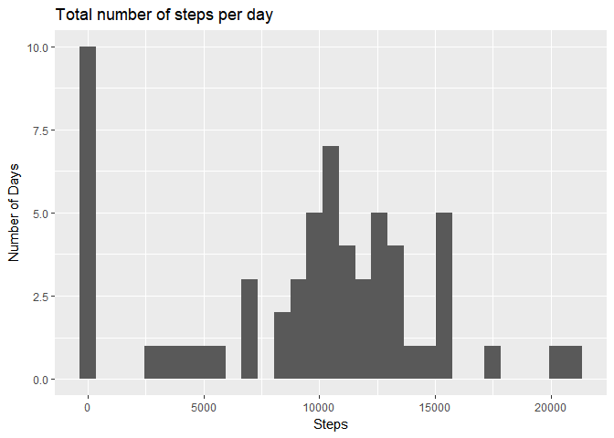
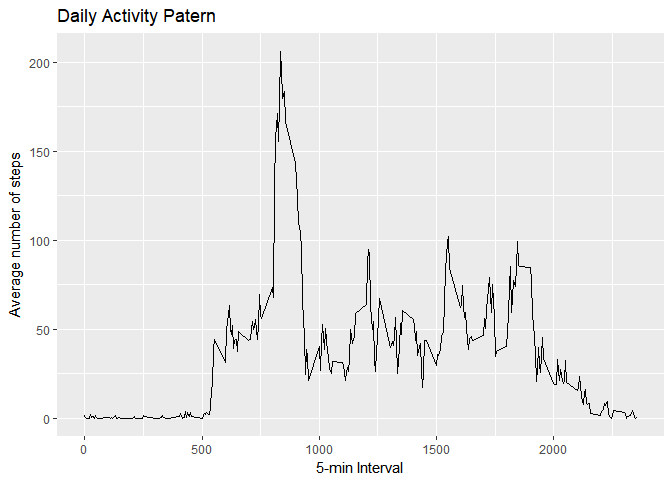
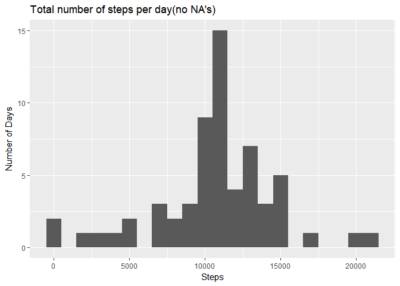
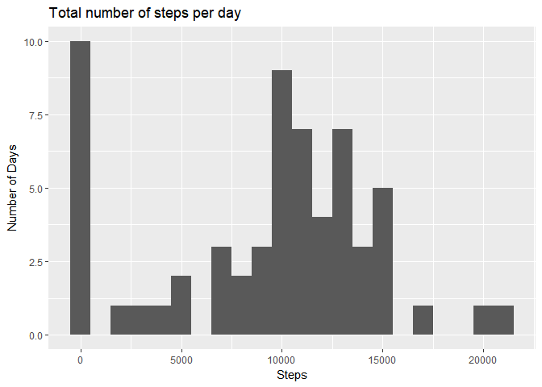
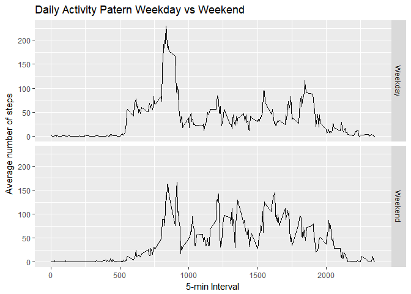

# Reproducible Research: Peer Assessment 1


## Loading and preprocessing the data

```r
library(readr)
data <- read.csv(unzip("activity.zip"))
```


## What is mean total number of steps taken per day?


```r
library(dplyr)
```

```
## 
## Attaching package: 'dplyr'
```

```
## The following objects are masked from 'package:stats':
## 
##     filter, lag
```

```
## The following objects are masked from 'package:base':
## 
##     intersect, setdiff, setequal, union
```

```r
daily_steps <- data %>% group_by(date) %>% 
        summarize(steps_day = sum(steps, na.rm = TRUE))
library(ggplot2)
ggplot(data = daily_steps, aes(steps_day)) + geom_histogram(binwidth = 700) +
        ggtitle("Total number of steps per day") + xlab("Steps") + ylab("Number of Days")
```

<!-- -->

```r
summary(daily_steps)[3:4,2]
```

```
##                                     
## "Median :10395  " "Mean   : 9354  "
```


## What is the average daily activity pattern?


```r
daily_activity <- data %>% group_by(interval) %>% 
        summarize(steps_day = mean(steps, na.rm = TRUE))


ggplot(data = daily_activity, aes(interval, steps_day)) + geom_line() +
        ggtitle("Daily Activity Patern") + xlab("5-min Interval") +
        ylab("Average number of steps")
```

<!-- -->

```r
# Day of highest activity
daily_activity[which.max(daily_activity$steps_day),]
```

```
## # A tibble: 1 × 2
##   interval steps_day
##      <int>     <dbl>
## 1      835  206.1698
```


## Imputing missing values

Number of missing values:

```r
summary(data)[7,1]
```

```
## [1] "NA's   :2304  "
```
Replacing missing values by the average  number of steps of per interval:

```r
data2<-data

index<-is.na(data2$steps)
index2<-which(is.na(data2$steps))

meanInterval <- rep(daily_activity$steps_day, 61)

data2$steps[index2]<-meanInterval[index2]
```

Steps data new set:

```r
daily_steps2 <- data2 %>% group_by(date) %>% 
        summarize(steps_day = sum(steps, na.rm = TRUE))

ggplot(data = daily_steps2, aes(steps_day)) + geom_histogram(binwidth = 1000) +
        ggtitle("Total number of steps per day(no NA's)") + xlab("Steps") + ylab("Number of Days")
```

<!-- -->

```r
ggplot(data = daily_steps, aes(steps_day)) + geom_histogram(binwidth = 1000) +
        ggtitle("Total number of steps per day") + xlab("Steps") + ylab("Number of Days")
```

<!-- -->


Steps data origina and new sets:

```r
# Original data
summary(daily_steps)[3:4,2]
```

```
##                                     
## "Median :10395  " "Mean   : 9354  "
```

```r
# Data with NA replaced by average interval value
summary(daily_steps2)[3:4,2]
```

```
##                                     
## "Median :10766  " "Mean   :10766  "
```
## Are there differences in activity patterns between weekdays and weekends?

```r
library(lubridate)
```

```
## 
## Attaching package: 'lubridate'
```

```
## The following object is masked from 'package:base':
## 
##     date
```

```r
# Function to Convert day in Week***
wk<-function(d){
        if(d == "Sunday"){
        return("Weekend")}
        else if(d=="Saturday"){
        return("Weekend")}        
        else{return("Weekday")}
}
# Function Vectorization
Vwk<-Vectorize(wk)
# Creating colunm of weekdays/weekend
days<-as_date(data2$date)
days<-  weekdays(days)
days<-Vwk(days)
days<-as.factor(days)
# adding the column

data2 <- data2 %>% mutate(day = days)

#
daily_activity3 <- data2 %>% group_by(interval, day) %>% 
        summarize(steps_day = mean(steps, na.rm = TRUE))
ggplot(data = daily_activity3, aes(interval, steps_day)) + geom_line() +
        ggtitle("Daily Activity Patern Weekday vs Weekend") + xlab("5-min Interval") +
        ylab("Average number of steps") + facet_grid(day~.)
```

<!-- -->

